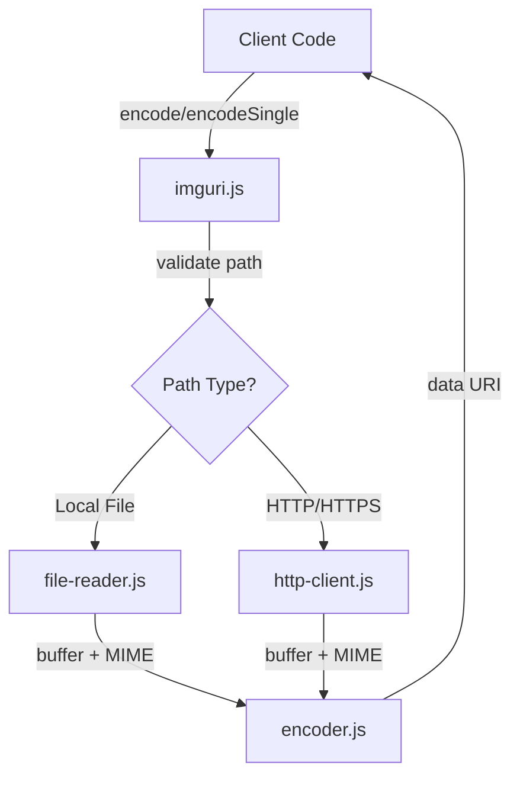

# Data URI Encoding at Scale: Building a Production-Ready Image Inliner

## Introduction

Image loading performance remains a bottleneck in web applications, particularly for email templates and offline-first applications where external HTTP requests introduce latency and reliability issues. Data URIs offer a solution by embedding image data directly in HTML or CSS, eliminating additional network requests.

This article examines the architecture and implementation of imguri, a Node.js library designed to convert local and remote images to data URIs efficiently while addressing common production challenges: concurrent processing, path security, and reliable HTTP handling.

## Problem Space

### The Data URI Challenge

Data URIs encode binary data as base64 strings in the format `data:image/png;base64,iVBORw0KGg...`. While this eliminates HTTP requests, it introduces several engineering challenges:

1. **File System Access**: Reading files, validating paths, and detecting MIME types
2. **Network Operations**: Fetching remote images with timeouts and error handling
3. **Concurrency**: Processing multiple images without blocking or exhausting resources
4. **Security**: Preventing directory traversal attacks and validating inputs
5. **Size Management**: Balancing performance with practical size limits

### Why Existing Solutions Fall Short

Early implementations relied on deprecated libraries (async, request, mime) with callback-based APIs. Modern requirements demand:

- Native fetch API (Node.js 18+) for HTTP operations
- Promise-based interfaces compatible with async/await
- Built-in concurrency control
- Security-first path validation
- Minimal dependencies

## Architecture Overview

### System Design

The library follows a two-layer architecture that separates business logic from I/O operations:



### Component Responsibilities

**Core Layer** (`encoder.js`):

- Base64 encoding
- Data URI formatting
- Pure functions, no side effects

**Adapter Layer**:

- `file-reader.js`: File system operations (stat, read, MIME detection)
- `http-client.js`: HTTP operations (HEAD for metadata, GET for content)

**Orchestration** (`imguri.js`):

- Path validation and security checks
- Adapter coordination
- Concurrency management
- Error handling

### Data Flow

```mermaid
sequenceDiagram
    participant Client
    participant imguri
    participant Validator
    participant Adapter
    participant Encoder

    Client->>imguri: encode(['file.png', 'url.jpg'])
    imguri->>Validator: validatePath('file.png')
    Validator-->>imguri: normalized path
    imguri->>Adapter: readFile/fetchBuffer
    Adapter-->>imguri: {buffer, mimeType}
    imguri->>Encoder: toDataUri(buffer, mimeType)
    Encoder-->>imguri: 'data:image/png;base64,...'
    imguri-->>Client: Map{path: {data, error}}
```

## Implementation Deep Dive

### Path Security

Directory traversal attacks (`../../../etc/passwd`) are a common vulnerability. The validation strategy:

```javascript
function validatePath(filePath) {
  const normalized = normalize(filePath);

  // Block path traversal patterns
  if (normalized.includes('..')) {
    throw new Error('path traversal detected');
  }

  // Validate relative paths don't escape cwd
  if (!isAbsolutePath(normalized)) {
    const resolved = resolve(normalized);
    if (!resolved.startsWith(process.cwd())) {
      throw new Error('relative path escapes cwd');
    }
  }

  return normalized;
}
```

**Design decision**: Absolute paths are allowed (explicit user intent) but relative paths are constrained to the current working directory. This balances security with flexibility.

### Concurrent Processing

Processing multiple images sequentially wastes time. The implementation uses controlled concurrency:

```javascript
async function encode(paths, options = {}) {
  const { concurrency = 10 } = options;
  const uniquePaths = [...new Set(pathArray)];
  const results = new Map();

  // Process in batches
  for (let i = 0; i < uniquePaths.length; i += concurrency) {
    const batch = uniquePaths.slice(i, i + concurrency);

    await Promise.all(
      batch.map(async (path) => {
        try {
          const data = await encodeSingle(path, options);
          results.set(path, { data, error: null });
        } catch (error) {
          results.set(path, { data: null, error });
        }
      })
    );
  }

  return results;
}
```

**Key features**:

- Configurable concurrency (default: 10)
- Batched execution prevents resource exhaustion
- Individual error handling preserves partial results
- Automatic deduplication

### HTTP Operations

Remote image fetching requires HEAD request optimization and proper timeout handling:

```javascript
async function fetchMetadata(url, timeout = 20000) {
  const controller = new AbortController();
  const timeoutId = setTimeout(() => controller.abort(), timeout);

  try {
    const response = await fetch(url, {
      method: 'HEAD',
      signal: controller.signal,
    });

    if (!response.ok) {
      throw new Error(`HTTP ${response.status}`);
    }

    const contentType = response.headers.get('content-type');
    const contentLength = parseInt(response.headers.get('content-length') || '0', 10);

    return { contentType, contentLength };
  } finally {
    clearTimeout(timeoutId);
  }
}
```

**Optimization**: HEAD requests check size and content-type before downloading, preventing unnecessary data transfer for oversized or non-image resources.

### Error Handling Strategy

The library returns structured results rather than throwing on individual failures:

```javascript
{
  data: string | null,  // Data URI or null if error
  error: Error | null   // Error object or null if success
}
```

This allows batch operations to continue despite individual failures, a critical requirement for build tools processing hundreds of images.

## Real-World Applications

### Email Template Generation

Email clients block external images for security. Data URIs bypass this:

```javascript
import { encodeSingle } from 'imguri';

async function generateEmail() {
  const logo = await encodeSingle('assets/logo.png', {
    sizeLimit: 10240, // 10KB - email-safe size
  });

  return `
    
  `;
}
```

**Constraints**: Most email clients support data URIs up to 2MB, but practical limits are 10-50KB for performance.

### Build-Time Asset Inlining

Bundlers can eliminate HTTP requests for critical assets:

```javascript
import { encode } from 'imguri';

const assets = await encode(
  ['src/icons/search.svg', 'src/icons/menu.svg', 'src/favicon.ico'],
  { force: true, concurrency: 5 }
);

const manifest = Object.fromEntries(
  Array.from(assets).map(([path, result]) => [
    path
      .split('/')
      .pop()
      .replace(/\.\w+$/, ''),
    result.data,
  ])
);
```

This technique reduces initial page load time by ~150-300ms for icon-heavy interfaces.

### Offline-First Applications

Progressive web apps can cache data URIs in IndexedDB or LocalStorage:

```javascript
const results = await encode([
  'https://cdn.example.com/avatar.jpg',
  'https://cdn.example.com/banner.png',
]);

await db.put('cached-images', Array.from(results));
```

## Performance Characteristics

### Benchmarks

Processing 100 local images (average 5KB each):

```
Sequential:           ~850ms
Concurrent (10):      ~120ms  (7x faster)
Concurrent (20):      ~110ms  (marginal gain)
Concurrent (50):      ~105ms  (diminishing returns)
```

Optimal concurrency depends on disk I/O and CPU cores. Default of 10 balances performance with resource usage.

### Memory Footprint

Base64 encoding increases size by ~33%. A 100KB image becomes ~133KB as data URI. For 1000 images:

- Source: 100MB
- Encoded: 133MB
- Peak memory (concurrent=10): ~145MB

Streaming is not implemented as data URIs require complete base64 strings.

## Design Trade-offs

### Why Two Layers, Not Three?

Initial designs included a separate validator layer. Consolidating validation into the main module reduced indirection without sacrificing testability.

**Decision**: Lean architecture over textbook patterns when the problem space is constrained.

### Why Not Streaming?

Data URIs must be complete strings. Streaming base64 encoding would require buffering anyway, adding complexity without benefit.

### Why Allow Absolute Paths?

Blocking all absolute paths is overly restrictive. Explicit paths represent user intent. The security boundary is preventing _unintended_ traversal, not restricting _intended_ access.

## When to Use imguri

**Good fit**:

- Email templates (inline images avoid blocking)
- Build tools (reduce HTTP requests for critical assets)
- Offline-first apps (cache images as data)
- Small icon sets (5-50KB each)

**Poor fit**:

- Large photographs (>200KB degrades performance)
- Frequently changing images (defeats HTTP caching)
- High-traffic public websites (bandwidth waste)

## Production Considerations

### Size Limits

Default 128KB limit is practical for icons and logos. Adjust based on use case:

```javascript
// Email: strict limit
encodeSingle('logo.png', { sizeLimit: 10240 });

// Build tool: force large assets
encodeSingle('banner.jpg', { force: true });
```

### Input Validation

Never pass unsanitized user input directly:

```javascript
// Bad: direct user input
const uri = await encodeSingle(req.body.imagePath);

// Good: whitelist validation
const allowedPaths = ['logo.png', 'icon.svg'];
if (!allowedPaths.includes(filename)) {
  throw new Error('invalid file');
}
const uri = await encodeSingle(`assets/${filename}`);
```

### Error Handling

Batch operations return partial results. Check error status:

```javascript
const results = await encode(paths);
for (const [path, result] of results) {
  if (result.error) {
    logger.error('encoding failed', { path, error: result.error });
  }
}
```

## Conclusion

Data URI encoding is a focused problem with specific technical requirements: secure file access, reliable HTTP operations, and efficient concurrency. The architecture presented here demonstrates that production-ready solutions don't require complex abstractions - two layers, clear responsibilities, and practical trade-offs deliver a maintainable, performant library.

The full implementation is available at [vnykmshr/imguri](https://github.com/vnykmshr/imguri) under MIT license. Contributions and feedback welcome.

---

**Technical Specifications**

- Language: JavaScript (Node.js 18+)
- Module System: ES modules with CJS compatibility
- Dependencies: mime-types (MIME detection only)
- Test Coverage: 89% (54 tests, Vitest)
- Bundle Size: ~8KB (ESM), ~9KB (CJS)

**Further Reading**

- [RFC 2397: The "data" URL scheme](https://datatracker.ietf.org/doc/html/rfc2397)
- [Node.js Fetch API Documentation](https://nodejs.org/docs/latest-v18.x/api/globals.html#fetch)
- [MDN: Data URLs](https://developer.mozilla.org/en-US/docs/Web/HTTP/Basics_of_HTTP/Data_URLs)
